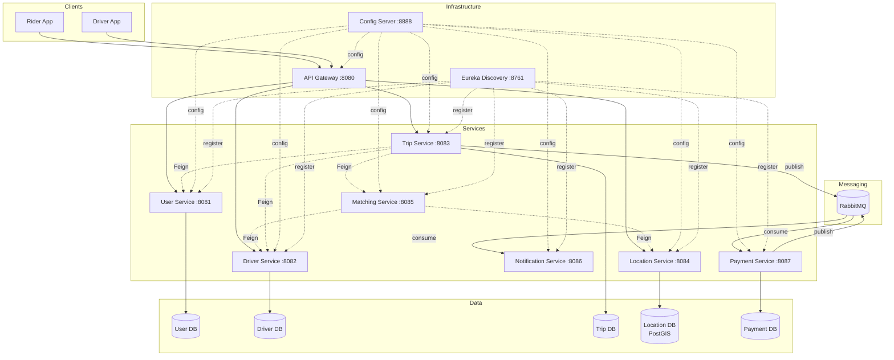

# Ride-Sharing Backend — Complete System Documentation

> **A Production-Grade Microservices Architecture**  
> Java 21 · Spring Boot 3 · PostgreSQL · PostGIS · Spring Cloud · RabbitMQ · Docker · AWS

**Version:** 1.0  
**Last Updated:** July 2026  
**Author:** Build-in-public documentation for learning and portfolio demonstration

---

## About This Documentation

This is the **complete guide** to understanding, building, and operating a production-grade ride-sharing backend system. It's designed for:

- **Software engineers** learning microservices architecture
- **Recruiters and hiring managers** evaluating technical depth
- **AI agents** needing comprehensive system context
- **Students** studying distributed systems patterns

This documentation is self-contained. You can read it start-to-finish as a book, or jump to specific sections as a reference manual.

---

## Table of Contents

### PART I — SYSTEM OVERVIEW
1. [Executive Summary](#1-executive-summary)
2. [What Makes This Project Architecturally Interesting?](#2-what-makes-this-project-architecturally-interesting)
3. [Technology Stack](#3-technology-stack)
4. [System Architecture Overview](#4-system-architecture-overview)
5. [Project Timeline and Build Progress](#5-project-timeline-and-build-progress)

### PART II — ARCHITECTURE DEEP DIVE
6. [Service Boundaries and Responsibilities](#6-service-boundaries-and-responsibilities)
7. [Infrastructure Components](#7-infrastructure-components)
8. [Database Design and Data Ownership](#8-database-design-and-data-ownership)
9. [Authentication and Security Architecture](#9-authentication-and-security-architecture)
10. [Communication Patterns](#10-communication-patterns)

### PART III — CORE WORKFLOWS
11. [The Complete Trip Lifecycle](#11-the-complete-trip-lifecycle)
12. [The Matching Algorithm](#12-the-matching-algorithm)
13. [Real-Time Location Tracking](#13-real-time-location-tracking)
14. [Payment Processing Flow](#14-payment-processing-flow)
15. [Notification System](#15-notification-system)

### PART IV — DISTRIBUTED SYSTEMS PATTERNS
16. [Transactions and ACID Properties](#16-transactions-and-acid-properties)
17. [Race Conditions and Concurrency Control](#17-race-conditions-and-concurrency-control)
18. [Idempotency and At-Least-Once Delivery](#18-idempotency-and-at-least-once-delivery)
19. [Event-Driven Architecture](#19-event-driven-architecture)
20. [State Machines](#20-state-machines)

### PART V — FAILURE HANDLING
21. [Every Failure Scenario Mapped](#21-every-failure-scenario-mapped)
22. [Resilience Patterns](#22-resilience-patterns)
23. [Monitoring and Observability](#23-monitoring-and-observability)

### PART VI — API REFERENCE
24. [Complete API Documentation](#24-complete-api-documentation)
25. [Service-to-Service Communication](#25-service-to-service-communication)

### PART VII — DEPLOYMENT
26. [Local Development Setup](#26-local-development-setup)
27. [Docker and Containerization](#27-docker-and-containerization)
28. [AWS Production Deployment](#28-aws-production-deployment)

### PART VIII — LEARNING JOURNEY
29. [Technology Dependency Graph](#29-technology-dependency-graph)
30. [Build Order and Learning Strategy](#30-build-order-and-learning-strategy)
31. [Key Decisions and Trade-offs](#31-key-decisions-and-trade-offs)

### APPENDICES
- [Appendix A: Glossary](#appendix-a-glossary)
- [Appendix B: Configuration Reference](#appendix-b-configuration-reference)
- [Appendix C: Database Schemas](#appendix-c-database-schemas)
- [Appendix D: Message Formats](#appendix-d-message-formats)

---

# PART I — SYSTEM OVERVIEW

## 1. Executive Summary

### What Problem Does This System Solve?

A ride-sharing platform coordinates three things in real time, at scale:

- **Riders** who need to go somewhere
- **Drivers** who have capacity and location
- **Trips** that match the two, track progress, and settle payment

The hard part isn't CRUD operations. It's that everything is **live, geographically indexed, and concurrent** — thousands of drivers moving every few seconds, riders requesting trips that must be matched within seconds, and state (trip status, driver availability, location) that must stay consistent across services that don't share a database.

### System Capabilities

This system handles:

✅ **User management** — riders and drivers with role-based access  
✅ **Driver profiles** — vehicles, verification status, availability  
✅ **Intelligent matching** — nearest available driver using PostGIS spatial queries  
✅ **Trip lifecycle** — from request through completion with state validation  
✅ **Real-time location** — GPS tracking with geospatial indexing  
✅ **Payment processing** — fare calculation, gateway integration, transaction ledger  
✅ **Async notifications** — event-driven push notifications  
✅ **Centralized auth** — JWT validation at API Gateway  
✅ **Service discovery** — dynamic scaling with Eureka  
✅ **Configuration management** — externalized config via Spring Cloud Config

### What Makes It Production-Grade?

This isn't a tutorial project with shortcuts. It implements real-world patterns:

- **Optimistic locking** prevents double-assignment race conditions
- **Idempotency** prevents double-charging on retries
- **State machines** enforce valid transitions
- **Split transactions** avoid long-held DB locks
- **Dead letter queues** handle poison messages
- **Unique constraints** provide database-level guards
- **Event sourcing patterns** for audit trails
- **Circuit breakers** for resilience (Phase 11)

### Key Metrics

- **8 microservices** (+ infrastructure components)
- **6 PostgreSQL databases** (including PostGIS)
- **3 message exchanges** on RabbitMQ
- **24 REST endpoints** exposed via Gateway
- **5 Feign clients** for synchronous inter-service calls
- **Multiple event consumers** for async workflows

---

## 2. What Makes This Project Architecturally Interesting?

### The Real Challenge: Distributed State Management

Because it forces you to confront problems that don't exist in a monolith:

**Challenge 1: Service Discovery**  
How do services find each other when they can scale up/down independently?  
→ Solved with **Eureka** dynamic service registry

**Challenge 2: Fault Isolation**  
How do you avoid one service's failure cascading into a total outage?  
→ Solved with **async messaging** and **circuit breakers**

**Challenge 3: Real-Time Updates**  
How do you broadcast "driver moved" or "trip status changed" to the right clients?  
→ Solved with **RabbitMQ topic exchanges** and routing keys

**Challenge 4: Configuration Drift**  
How do you keep configuration consistent across dozens of running instances?  
→ Solved with **Spring Cloud Config Server**

**Challenge 5: Race Conditions**  
How do you prevent two trips from claiming the same driver simultaneously?  
→ Solved with **optimistic locking** (@Version)

**Challenge 6: Idempotency**  
How do you prevent double-charging when messages are redelivered?  
→ Solved with **unique constraints + idempotency keys**

### Engineering Skills You'll Gain

This project is essentially a **microservices systems-design course disguised as a ride-sharing app.**

- Designing service boundaries around business capabilities, not database tables
- Operating distributed systems: discovery, config, gateways, async messaging
- Reasoning about consistency, failure modes, and partial outages
- Geospatial querying at scale (PostGIS)
- Containerized, production-style deployment workflows
- Debugging across process and network boundaries

### Why Microservices Here Specifically?

Not "because microservices are modern" — but because the components genuinely have **different scaling profiles and failure tolerances**:

| Component | Why It Needs Independence |
|---|---|
| **Location Service** | High-frequency writes (driver GPS pings every few seconds) — needs independent scaling |
| **Matching Service** | CPU/logic-heavy — benefits from independent scaling during demand spikes |
| **Notification Service** | Can degrade gracefully (a delayed push notification is annoying, not catastrophic) |
| **Payment Service** | Needs strict isolation, auditability, and different deployment cadence (compliance-sensitive) |

If one of these were down, the others should largely keep working. That's the core value proposition — **isolating blast radius and scaling independently**.

---

## 3. Technology Stack

### Core Stack

| Technology | Version | Purpose |
|---|---|---|
| **Java** | 21 | Primary language |
| **Spring Boot** | 3.x | Service framework |
| **Spring Cloud** | 2023.x | Microservices infrastructure |
| **PostgreSQL** | 15+ | Primary database |
| **PostGIS** | 3.4+ | Geospatial extension |
| **RabbitMQ** | 3.13+ | Message broker |
| **Maven** | 3.9+ | Build tool |
| **Docker** | 24+ | Containerization |
| **AWS** | — | Cloud infrastructure |

### Spring Cloud Components

| Component | Purpose |
|---|---|
| **Config Server** | Centralized configuration management |
| **Eureka Server** | Service registry and discovery |
| **Gateway** | API gateway with JWT validation |
| **OpenFeign** | Declarative REST clients |
| **Spring Cloud Sleuth** | Distributed tracing (future) |

### Key Libraries

| Library | Purpose |
|---|---|
| **Spring Data JPA** | Database access |
| **Spring Security** | Authentication (BCrypt) |
| **jjwt** | JWT token generation/validation |
| **Hibernate** | ORM |
| **JTS Topology Suite** | Geometry types for PostGIS |
| **Spring AMQP** | RabbitMQ integration |
| **Lombok** | Boilerplate reduction |

### Development Tools

- **IntelliJ IDEA** — Primary IDE
- **Postman** — API testing
- **DBeaver** — Database management
- **RabbitMQ Management UI** — Queue monitoring
- **Docker Compose** — Local orchestration

---

## 4. System Architecture Overview

### High-Level Architecture Diagram



### Request Flow Example

**Rider requests a trip:**

1. Rider app sends request to **API Gateway**
2. Gateway validates JWT and routes to **Trip Service**
3. Trip Service validates rider via **User Service** (Feign)
4. Trip Service calls **Matching Service** to find a driver
5. Matching Service queries **Location Service** (PostGIS nearest-neighbor)
6. Matching Service validates driver availability via **Driver Service**
7. Matching Service atomically claims driver (optimistic locking)
8. Trip Service updates trip status and publishes event to **RabbitMQ**
9. **Notification Service** consumes event and sends push notifications

---

## 5. Project Timeline and Build Progress

### Build Phases Overview

| Phase | Component | Status | Key Learning |
|---|---|---|---|
| **Phase 0** | Foundations | ✅ Complete | PostgreSQL, JPA, JWT |
| **Phase 1** | Core Services | ✅ Complete | User, Driver, Trip services |
| **Phase 2** | Config Server | ✅ Complete | Centralized configuration |
| **Phase 3** | Eureka | ✅ Complete | Service discovery |
| **Phase 4** | API Gateway | ✅ Complete | Centralized auth, routing |
| **Phase 5** | Location Service | ✅ Complete | PostGIS spatial queries |
| **Phase 6** | Matching Service | ✅ Complete | Optimistic locking, race conditions |
| **Phase 7** | RabbitMQ + Notification | 🔜 In Progress | Event-driven architecture |
| **Phase 8** | Payment Service | 📋 Planned | Idempotency, transactions |
| **Phase 9** | Docker | ✅ Complete | Containerization |
| **Phase 10** | AWS Deployment | ✅ Complete | Cloud infrastructure |
| **Phase 11** | Monitoring | 📋 Future | Observability |

### Current System State

**What's Working:**
- ✅ Full trip creation flow with automated matching
- ✅ JWT authentication centralized at gateway
- ✅ All services registered with Eureka
- ✅ PostGIS spatial queries for nearest driver
- ✅ Optimistic locking prevents race conditions
- ✅ Dockerized services with docker-compose
- ✅ Deployed to AWS EC2 with ECR

**What's Next:**
- 🔜 RabbitMQ integration for async events
- 🔜 Notification service (Phase 7)
- 🔜 Payment service with mock gateway (Phase 8)

### Development Strategy Applied

The project followed a **just-in-time learning** approach:

1. **Build business logic first** (User, Driver, Trip) as plain Spring Boot
2. **Add infrastructure incrementally** — one new complexity per phase
3. **Validate each layer** before adding the next
4. **Never debug business logic and infrastructure simultaneously**

This approach minimized risk and ensured each component was proven correct before layering on complexity.


---

# PART II — ARCHITECTURE DEEP DIVE

## 6. Service Boundaries and Responsibilities

### Design Principle: Domain-Driven Service Boundaries

Each service owns a **business capability**, not a database table. The boundary is: "Can this service fulfill its responsibility without calling another service for the happy path?"

### 6.1 User Service

**Port:** 8081  
**Database:** `rideshare_users`

**Core Responsibility:**  
Identity and profile management for riders and drivers.

**What It Owns:**
- User accounts, credentials (hashed), profile info, roles
- JWT token generation on login
- User authentication and registration

**APIs Exposed:**
- `POST /auth/register` — Register new user
- `POST /auth/login` — Login, receive JWT
- `GET /users/{id}` — Get user by ID
- `PUT /users/{id}` — Update user profile
- `GET /users/by-email/{email}` — Look up user by email

**Dependencies:** None (foundational service)

**What Does NOT Belong Here:**
- ❌ Driver-specific fields (vehicle, license, availability)
- ❌ Trip data
- ❌ Payment information
- ❌ Location coordinates

**Common Mistake to Avoid:**  
Stuffing driver-specific fields into the User table because "it's the same person." Keep identity separate from role-specific operational data.

---

### 6.2 Driver Service

**Port:** 8082  
**Database:** `rideshare_drivers`

**Core Responsibility:**  
Manage driver-specific operational state.

**What It Owns:**
- Driver profiles (linked to User via userId)
- Vehicle information and verification status
- Driver availability flags (ONLINE/OFFLINE/BUSY)
- Driver operational status (PENDING/ACTIVE/SUSPENDED)
- Driver ratings aggregate

**Key Entities:**
```java
Driver {
    id, userId, vehicleId,
    availability: ONLINE|OFFLINE|BUSY,
    status: PENDING|ACTIVE|SUSPENDED,
    rating, version (for optimistic locking)
}

Vehicle {
    id, plateNumber, make, model, color,
    verificationStatus: PENDING|VERIFIED|REJECTED
}
```

**Critical Endpoints:**
- `POST /drivers/{id}/claim` — Atomically set driver to BUSY (uses @Version)
- `POST /drivers/{id}/release` — Set driver back to ONLINE
- `POST /drivers/available` — Batch filter: return only ACTIVE + ONLINE drivers

**Dependencies:**
- User Service (for identity reference via userId — but never calls it)

**What Does NOT Belong Here:**
- ❌ Real-time GPS coordinates (that's Location Service)
- ❌ Trip history (that's Trip Service)
- ❌ User credentials (that's User Service)

**Common Mistake to Avoid:**  
Storing live location here. Location changes every few seconds — a different write pattern and scaling need than driver profile data.

---

### 6.3 Trip Service

**Port:** 8083  
**Database:** `rideshare_trips`

**Core Responsibility:**  
Owns the trip lifecycle — the "source of truth" for what's happening with a ride.

**What It Owns:**
- Trip records with state (REQUESTED → MATCHED → IN_PROGRESS → COMPLETED/CANCELLED)
- Pickup and drop locations
- Trip timing (start, end)
- Rider and driver assignment

**State Machine:**
```
REQUESTED → MATCHED → IN_PROGRESS → COMPLETED
     ↓           ↓           ↓
  CANCELLED   CANCELLED   CANCELLED
```

**Key Operations:**
- Create trip and trigger matching
- Validate state transitions
- Publish lifecycle events to RabbitMQ
- Coordinate with Matching Service
- Release driver on completion/cancellation

**Dependencies:**
- User Service (validate rider exists)
- Matching Service (find and assign driver)
- Driver Service (release driver)
- RabbitMQ (publish events)

**What Does NOT Belong Here:**
- ❌ Fare calculation (that's Payment Service)
- ❌ Actual payment processing
- ❌ Location queries (that's Location Service)
- ❌ Push notification logic (that's Notification Service)

**Common Mistake to Avoid:**  
Making Trip Service synchronously call Notification Service directly. If Notification is slow or down, trip creation shouldn't block — that's exactly what the message broker is for.

---

### 6.4 Location Service

**Port:** 8084  
**Database:** `rideshare_locations` (PostgreSQL + PostGIS)

**Core Responsibility:**  
Ingest and serve real-time geospatial data.

**What It Owns:**
- Current and recent driver coordinates
- Geospatial indexes (GIST on geometry columns)
- "Nearest drivers to point X" queries

**Key Technology:**
- **PostGIS extension** for spatial types and functions
- **JTS (Java Topology Suite)** for geometry objects
- `ST_DWithin` for radius queries
- `ST_Distance` for sorting by distance

**Entity:**
```java
DriverLocation {
    id,
    driverId,
    location: Point (PostGIS geometry),
    timestamp
}
```

**Critical Query:**
```sql
SELECT driver_id, ST_Distance(location, ST_MakePoint(?, ?)) as distance
FROM driver_locations
WHERE ST_DWithin(location, ST_MakePoint(?, ?), ?)
ORDER BY distance ASC
```

**APIs:**
- `POST /locations/ping` — Update driver's GPS coordinates
- `POST /locations/drivers/nearby` — Find nearby drivers within radius

**Dependencies:** None (standalone service)

**What Does NOT Belong Here:**
- ❌ Trip status
- ❌ Driver profile data
- ❌ Payment data

**Common Mistake to Avoid:**  
Writing every single GPS ping straight to PostgreSQL without a cache layer — this becomes the first bottleneck under real load. Also: not understanding that "nearest driver" queries need spatial indexes, not naive lat/lng range filters.

---

### 6.5 Matching Service

**Port:** 8085  
**Database:** None (stateless orchestrator)

**Core Responsibility:**  
The "brain" that pairs a trip request with a driver.

**What It Does:**
1. Query nearby available drivers (expanding radius: 3km → 5km → 8km → 12km → 20km)
2. Apply matching logic (distance, rating, acceptance rate)
3. Atomically claim driver to prevent double-assignment
4. Handle race conditions with fallback to next driver

**Algorithm:**
```
FOR each radius in [3000, 5000, 8000, 12000, 20000]:
    nearby = LocationService.findNearbyDrivers(pickup, radius)
    IF nearby is empty: continue to next radius
    
    available = DriverService.filterAvailable(nearby)
    IF available is empty: continue to next radius
    
    FOR each driver in available (sorted by distance):
        TRY:
            DriverService.claimDriver(driver.id)
            RETURN driver.id (success)
        CATCH Conflict (409):
            continue to next driver (already claimed)
    
THROW NoDriverAvailableException
```

**Dependencies:**
- Location Service (spatial queries)
- Driver Service (availability filter + atomic claim)

**What Does NOT Belong Here:**
- ❌ Persisted trip records (Trip Service owns that)
- ❌ Driver profile storage (Driver Service owns that)

**Common Mistake to Avoid:**  
Treating matching as a simple "first driver found" query without handling the race condition of multiple trips trying to match the same driver simultaneously.

---

### 6.6 Notification Service

**Port:** 8086  
**Database:** None (or notification logs)

**Core Responsibility:**  
Deliver alerts to riders and drivers (push, SMS, in-app).

**What It Does:**
- Consume events from RabbitMQ message broker
- Format messages for riders and drivers
- Call external push/SMS providers (FCM, APNs, Twilio)
- Log notification delivery status

**Event Consumers:**
- `trip.matched` → "Driver X is on the way"
- `trip.completed` → "Trip finished"
- `payment.completed` → "₹398.30 charged to your card"

**Dependencies:**
- RabbitMQ (event source)
- External push provider (FCM/APNs)

**What Does NOT Belong Here:**
- ❌ Business logic about *when* to notify — that decision belongs to the service that owns the state change (Trip, Payment)
- ❌ Fare calculation
- ❌ Trip status management

**Common Mistake to Avoid:**  
Making other services call Notification Service synchronously via REST. This couples availability of unrelated services and is the textbook use case for async messaging.

---

### 6.7 Payment Service

**Port:** 8087  
**Database:** `rideshare_payments`

**Core Responsibility:**  
Handle fare calculation and payment processing.

**What It Owns:**
- Fare calculation logic (base fare + distance + time + surge)
- Payment transactions and ledger
- Integration with payment gateway (mock or Stripe)
- Payment status tracking (PENDING → COMPLETED/FAILED)

**State Machine:**
```
PENDING → COMPLETED
   ↓
FAILED
```

**Key Patterns:**
- **Idempotency** (3 layers: unique constraint + check + gateway key)
- **Split transactions** (short DB → long gateway call → short DB)
- **Optimistic locking** (@Version on Payment entity)
- **Event-driven** (consumes trip.completed, publishes payment.completed)

**Dependencies:**
- Trip Service (via events, not direct calls)
- Payment Gateway (mock or real Stripe)
- RabbitMQ

**What Does NOT Belong Here:**
- ❌ Trip status management
- ❌ User profile data
- ❌ Raw card numbers (always tokenize via gateway)

**Common Mistake to Avoid:**  
Not making payment operations idempotent — retries on a payment API without idempotency keys can cause double-charging.

---

## 7. Infrastructure Components

### 7.1 Config Server

**Port:** 8888  
**Technology:** Spring Cloud Config

**Purpose:**  
Centralized configuration management for all services.

**Configuration Storage:**
```
infrastructure/config-server/src/main/resources/config/
├── application.yaml       (shared config)
├── userservice.yaml
├── driverservice.yaml
├── tripservice.yaml
├── locationservice.yaml
├── matchingservice.yaml
├── paymentservice.yaml
├── notificationservice.yaml
├── gatewayserver.yaml
└── eurekaserver.yaml
```

**Key Configurations Managed:**
- Database connection strings
- JWT signing secret (shared across User Service and Gateway)
- Service ports
- Eureka server URL
- RabbitMQ connection details

**How Services Consume:**
```yaml
# bootstrap.yaml in each service
spring:
  config:
    import: configserver:http://localhost:8888
  application:
    name: userservice
```

**Benefits:**
- Single source of truth for configuration
- Environment-specific configs (dev/staging/prod profiles)
- Change config without code redeployment
- No hardcoded secrets in source code

---

### 7.2 Eureka Server

**Port:** 8761  
**Technology:** Spring Cloud Netflix Eureka

**Purpose:**  
Service registry and discovery — services find each other dynamically.

**How It Works:**

1. **Service Registration:**
   ```yaml
   # Each service registers itself on startup
   eureka:
     client:
       serviceUrl:
         defaultZone: http://localhost:8761/eureka/
     instance:
       preferIpAddress: true
   ```

2. **Service Discovery:**
   ```java
   @FeignClient(name = "userservice") // No hardcoded URL
   public interface UserFeignClient {
       @GetMapping("/users/{id}")
       UserDto getUserById(@PathVariable Long id);
   }
   ```

3. **Health Checks:**
   - Services send heartbeats every 30 seconds
   - Eureka marks unhealthy instances as DOWN
   - Feign clients automatically route to healthy instances

**Dashboard:**  
`http://localhost:8761` — Shows all registered services

**Benefits:**
- No hardcoded service URLs
- Services can scale horizontally
- Automatic load balancing via Ribbon
- Failure detection and routing around unhealthy instances

---

### 7.3 API Gateway

**Port:** 8080 (single entry point)  
**Technology:** Spring Cloud Gateway (WebFlux/reactive)

**Core Responsibilities:**

1. **Routing** — Forward requests to correct services
2. **Authentication** — Validate JWT tokens
3. **Cross-cutting concerns** — Logging, rate limiting, CORS

**Route Configuration:**
```yaml
spring:
  cloud:
    gateway:
      routes:
        - id: userservice
          uri: lb://USERSERVICE
          predicates:
            - Path=/users/**, /auth/**
        
        - id: driverservice
          uri: lb://DRIVERSERVICE
          predicates:
            - Path=/drivers/**, /vehicles/**
        
        - id: tripservice
          uri: lb://TRIPSERVICE
          predicates:
            - Path=/trips/**
```

**JWT Validation Filter:**
```java
@Component
public class JwtAuthenticationFilter implements GlobalFilter {
    
    @Override
    public Mono<Void> filter(ServerWebExchange exchange, GatewayFilterChain chain) {
        String path = exchange.getRequest().getPath().toString();
        
        // Public routes
        if (path.equals("/auth/register") || path.equals("/auth/login")) {
            return chain.filter(exchange);
        }
        
        // Extract and validate JWT
        String token = extractToken(exchange.getRequest());
        if (token == null || !jwtService.isTokenValid(token)) {
            exchange.getResponse().setStatusCode(HttpStatus.UNAUTHORIZED);
            return exchange.getResponse().setComplete();
        }
        
        // Valid token — forward to service
        return chain.filter(exchange);
    }
}
```

**Benefits:**
- Single entry point for all client traffic
- Centralized authentication (no JWT validation code in services)
- Easier to add rate limiting, logging, metrics
- Hides internal service topology from clients

---

### 7.4 RabbitMQ Message Broker

**Ports:** 5672 (AMQP), 15672 (Management UI)  
**Technology:** RabbitMQ 3.13+

**Purpose:**  
Asynchronous, event-driven communication between services.

**Exchange and Queue Structure:**

```
trip.events (TopicExchange)
├── routing key: trip.matched
│   └── Queue: notification.trip.matched → Notification Service
├── routing key: trip.completed
│   ├── Queue: notification.trip.completed → Notification Service
│   └── Queue: payment.trip.completed → Payment Service
└── routing key: trip.cancelled
    └── Queue: notification.trip.cancelled → Notification Service

payment.events (TopicExchange)
└── routing key: payment.completed
    └── Queue: notification.payment.completed → Notification Service

trip.events.dlx (Dead Letter Exchange)
└── Queue: trip.events.dead-letter (manual inspection)
```

**Message Flow Example:**

1. **Trip Service (Publisher):**
   ```java
   @Component
   public class TripEventPublisher {
       private final RabbitTemplate rabbitTemplate;
       
       public void publishTripCompleted(Trip trip) {
           TripCompletedEvent event = new TripCompletedEvent(
               trip.getId(),
               trip.getRiderId(),
               trip.getDriverId(),
               trip.getDistanceKm(),
               trip.getTripStartTime(),
               trip.getTripEndTime()
           );
           rabbitTemplate.convertAndSend(
               "trip.events",
               "trip.completed",
               event
           );
       }
   }
   ```

2. **Payment Service (Consumer):**
   ```java
   @Component
   public class TripEventConsumer {
       
       @RabbitListener(queues = "payment.trip.completed")
       public void onTripCompleted(TripCompletedEvent event) {
           paymentService.processPayment(event);
       }
   }
   ```

**Benefits:**
- Services decoupled in time (publisher doesn't wait for consumer)
- Consumer down? Messages held in queue, processed when it restarts
- Multiple consumers can process same event
- Dead letter queues handle poison messages

---

## 8. Database Design and Data Ownership

### Core Principle: Each Service Owns Its Database

**Never share databases across services.** This is the #1 rule of microservices data management.

```
✅ CORRECT:
User Service → rideshare_users DB
Driver Service → rideshare_drivers DB
Trip Service → rideshare_trips DB

❌ WRONG:
User Service ──┐
Driver Service ├──→ shared_rideshare DB
Trip Service ──┘
```

### Why This Matters

| Violation | Consequence |
|---|---|
| Two services write to same table | Race conditions, unclear ownership |
| Service A queries Service B's tables | Tight coupling — B can't change schema without breaking A |
| Shared DB for "convenience" | Can't scale services independently, can't deploy independently |

### How Services Share Data

**Instead of shared DB, use:**

1. **Synchronous API calls** (when you need the result immediately)
   ```java
   // Trip Service needs rider's name
   UserDto rider = userFeignClient.getUserById(trip.getRiderId());
   ```

2. **Async events** (when eventual consistency is acceptable)
   ```java
   // Payment Service doesn't call Trip Service
   // It listens for TripCompletedEvent from RabbitMQ
   ```

3. **Data duplication** (when read performance is critical)
   ```java
   // Driver Service stores userId (foreign key reference)
   // But doesn't duplicate user's email, phone, etc.
   ```

### 8.1 User Service Database

**Database:** `rideshare_users`

**Schema:**
```sql
CREATE TABLE users (
    id BIGSERIAL PRIMARY KEY,
    username VARCHAR(100) NOT NULL,
    email VARCHAR(255) NOT NULL UNIQUE,
    password VARCHAR(255) NOT NULL,  -- BCrypt hashed
    phone_number VARCHAR(20) NOT NULL,
    role VARCHAR(20) NOT NULL,  -- RIDER or DRIVER
    created_at TIMESTAMP DEFAULT CURRENT_TIMESTAMP,
    updated_at TIMESTAMP DEFAULT CURRENT_TIMESTAMP
);

CREATE INDEX idx_users_email ON users(email);
```

**Constraints:**
- Email must be unique
- Role is enum (RIDER or DRIVER)
- Password never stored in plaintext

---

### 8.2 Driver Service Database

**Database:** `rideshare_drivers`

**Schema:**
```sql
CREATE TABLE drivers (
    id BIGSERIAL PRIMARY KEY,
    user_id BIGINT NOT NULL,  -- FK reference (not enforced at DB level)
    vehicle_id BIGINT,
    availability VARCHAR(20) NOT NULL DEFAULT 'OFFLINE',  -- ONLINE/OFFLINE/BUSY
    status VARCHAR(20) NOT NULL DEFAULT 'PENDING',  -- PENDING/ACTIVE/SUSPENDED
    rating DECIMAL(3,2) DEFAULT 0.0,
    version BIGINT DEFAULT 0,  -- Optimistic locking
    created_at TIMESTAMP DEFAULT CURRENT_TIMESTAMP,
    updated_at TIMESTAMP DEFAULT CURRENT_TIMESTAMP
);

CREATE TABLE vehicles (
    id BIGSERIAL PRIMARY KEY,
    plate_number VARCHAR(50) NOT NULL UNIQUE,
    make VARCHAR(100) NOT NULL,
    model VARCHAR(100) NOT NULL,
    color VARCHAR(50),
    verification_status VARCHAR(20) DEFAULT 'PENDING',  -- PENDING/VERIFIED/REJECTED
    created_at TIMESTAMP DEFAULT CURRENT_TIMESTAMP
);

CREATE INDEX idx_drivers_user_id ON drivers(user_id);
CREATE INDEX idx_drivers_availability ON drivers(availability);
```

**Key Point:**  
`user_id` is a reference to User Service's user table, but **not a foreign key constraint**. Driver Service never queries the users table directly — it calls User Service via Feign if needed.

---

### 8.3 Trip Service Database

**Database:** `rideshare_trips`

**Schema:**
```sql
CREATE TABLE trips (
    id BIGSERIAL PRIMARY KEY,
    rider_id BIGINT NOT NULL,
    driver_id BIGINT,
    pickup_latitude DECIMAL(10,8) NOT NULL,
    pickup_longitude DECIMAL(11,8) NOT NULL,
    drop_latitude DECIMAL(10,8) NOT NULL,
    drop_longitude DECIMAL(11,8) NOT NULL,
    distance_km DECIMAL(6,2),
    status VARCHAR(20) NOT NULL,  -- REQUESTED/MATCHED/IN_PROGRESS/COMPLETED/CANCELLED
    trip_start_time TIMESTAMP,
    trip_end_time TIMESTAMP,
    created_at TIMESTAMP DEFAULT CURRENT_TIMESTAMP,
    updated_at TIMESTAMP DEFAULT CURRENT_TIMESTAMP
);

CREATE INDEX idx_trips_rider_id ON trips(rider_id);
CREATE INDEX idx_trips_driver_id ON trips(driver_id);
CREATE INDEX idx_trips_status ON trips(status);
```

**State Validation:**  
State transitions are enforced in application code, not DB constraints:
```java
REQUESTED → MATCHED → IN_PROGRESS → COMPLETED
     ↓           ↓           ↓
  CANCELLED   CANCELLED   CANCELLED
```

---

### 8.4 Location Service Database

**Database:** `rideshare_locations` (PostgreSQL + PostGIS)

**Schema:**
```sql
-- Enable PostGIS extension
CREATE EXTENSION IF NOT EXISTS postgis;

CREATE TABLE driver_locations (
    id BIGSERIAL PRIMARY KEY,
    driver_id BIGINT NOT NULL,
    location GEOMETRY(Point, 4326) NOT NULL,  -- PostGIS type
    timestamp TIMESTAMP DEFAULT CURRENT_TIMESTAMP
);

-- Spatial index for fast radius queries
CREATE INDEX idx_driver_locations_geom ON driver_locations USING GIST(location);
CREATE INDEX idx_driver_locations_driver_id ON driver_locations(driver_id);
```

**Key Query:**
```sql
-- Find drivers within 5km of a point, sorted by distance
SELECT 
    driver_id,
    ST_Distance(location, ST_MakePoint(77.2090, 28.6139)::geography) as distance_meters
FROM driver_locations
WHERE ST_DWithin(
    location::geography,
    ST_MakePoint(77.2090, 28.6139)::geography,
    5000  -- 5km in meters
)
ORDER BY distance_meters ASC;
```

**Why PostGIS:**  
- Spatial indexes (GIST) make radius queries orders of magnitude faster
- Native distance calculations (haversine formula)
- Supports complex geometries (future: service areas, geofences)

---

### 8.5 Payment Service Database

**Database:** `rideshare_payments`

**Schema:**
```sql
CREATE TABLE payments (
    id BIGSERIAL PRIMARY KEY,
    trip_id BIGINT NOT NULL UNIQUE,  -- One payment per trip
    rider_id BIGINT NOT NULL,
    amount DECIMAL(10,2) NOT NULL,
    status VARCHAR(20) NOT NULL,  -- PENDING/COMPLETED/FAILED
    transaction_id VARCHAR(255),  -- From gateway
    idempotency_key VARCHAR(255) NOT NULL UNIQUE,  -- "trip-{tripId}"
    version BIGINT DEFAULT 0,  -- Optimistic locking
    created_at TIMESTAMP DEFAULT CURRENT_TIMESTAMP,
    updated_at TIMESTAMP DEFAULT CURRENT_TIMESTAMP,
    
    CONSTRAINT uq_payments_trip_id UNIQUE (trip_id),
    CONSTRAINT uq_payments_idempotency_key UNIQUE (idempotency_key)
);

CREATE INDEX idx_payments_rider_id ON payments(rider_id);
CREATE INDEX idx_payments_status ON payments(status);
```

**Critical Constraints:**
- `trip_id` unique — prevents duplicate payments
- `idempotency_key` unique — prevents retries from creating duplicates
- `version` for optimistic locking

