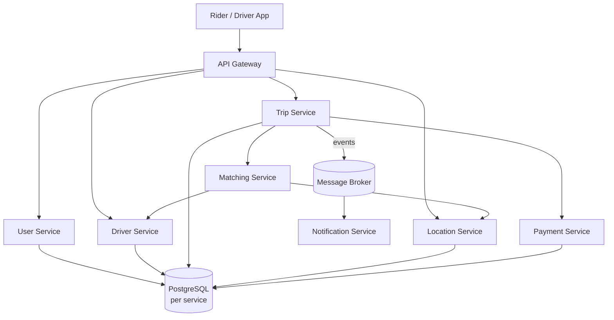
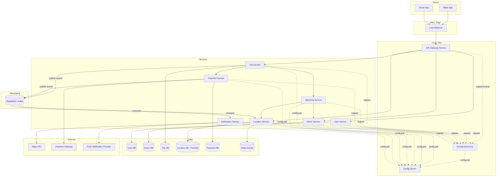

# Ride-Sharing Platform — Onboarding Blueprint

A complete mental model of the system before writing any code.

---

## 1. Executive Overview

### What problem does this system solve?

A ride-sharing platform coordinates three things in real time, at scale:

- **Riders** who need to go somewhere
- **Drivers** who have capacity and location
- **Trips** that match the two, track progress, and settle payment

The hard part isn't CRUD. It's that everything is **live, geographically indexed, and concurrent** — thousands of drivers moving every few seconds, riders requesting trips that must be matched within seconds, and state (trip status, driver availability, location) that must stay consistent across services that don't share a database.

### Why is this project architecturally interesting?

Because it forces you to confront problems that don't exist in a monolith:

- How do services find each other when they can scale up/down independently?
- How do you avoid one service's failure cascading into a total outage?
- How do you broadcast "driver moved" or "trip status changed" to the right clients in real time?
- How do you keep configuration consistent across dozens of running instances?
- How do you deploy a change to one service without redeploying everything?

This project is essentially a **microservices systems-design course disguised as a ride-sharing app**.

### What engineering skills will you gain?

- Designing service boundaries around business capabilities, not database tables
- Operating distributed systems: discovery, config, gateways, async messaging
- Reasoning about consistency, failure modes, and partial outages
- Geospatial querying at scale (PostGIS)
- Containerized, production-style deployment workflows
- Debugging across process and network boundaries — the skill that separates senior engineers from junior ones

### Why are microservices useful *here* specifically?

Not "because microservices are modern" — but because the components genuinely have **different scaling profiles and failure tolerances**:

- The **Location/Tracking service** gets hammered with high-frequency writes (driver GPS pings every few seconds) and needs to scale independently.
- The **Trip Matching service** is CPU/logic-heavy and benefits from independent scaling during demand spikes.
- The **Notification service** can degrade gracefully (a delayed push notification is annoying, not catastrophic) — so it shouldn't be allowed to slow down trip creation.
- **Payments** need strict isolation, auditability, and different deployment cadence (compliance-sensitive code changes less often, more carefully).

If one of these were down, the others should largely keep working. That's the core value proposition — **isolating blast radius and scaling independently** — and it's why this architecture is worth the added complexity.

---

## 2. The Ocean Map

### Major Components

**Services**
- User Service (riders + drivers identity, profiles, auth)
- Driver Service (driver-specific state: status, vehicle, availability)
- Trip Service (trip lifecycle: requested → matched → in-progress → completed)
- Location/Tracking Service (real-time driver location ingestion + queries)
- Matching Service (matches riders to nearby available drivers)
- Notification Service (push/SMS/in-app alerts)
- Payment Service (fare calculation, payment processing, ledgers)

**Infrastructure**
- API Gateway (single entry point for clients)
- Service Discovery (Eureka) — services find each other dynamically
- Config Server — centralized configuration for all services
- Message Broker (RabbitMQ or Kafka) — async communication
- Load Balancer (in front of the gateway, in production)

**Data Stores**
- PostgreSQL (per-service databases — never shared)
- PostgreSQL + PostGIS (geospatial queries for Location/Matching)
- Redis (optional — caching driver locations, session data)

**External Systems**
- Maps/Geocoding API (e.g., Google Maps, Mapbox)
- Payment Gateway (e.g., Stripe)
- Push Notification Provider (e.g., FCM/APNs)

**Deployment Components**
- Docker containers per service
- Container orchestration (Docker Compose locally → ECS/Kubernetes in production)
- AWS infrastructure (VPC, ALB, RDS, ECR, CloudWatch)

---

### A) Beginner Architecture Diagram



**Request flow (simple example — rider requests a trip):**

1. Rider app sends request to **API Gateway**.
2. Gateway routes to **Trip Service** → creates trip in "REQUESTED" state.
3. Trip Service asks **Matching Service** to find a driver.
4. Matching Service queries **Location Service** (PostGIS "nearest drivers" query).
5. Matching Service confirms a driver via **Driver Service**, assigns the trip.
6. Trip Service updates trip to "MATCHED" and publishes an event to the **Message Broker**.
7. **Notification Service** consumes the event and pushes alerts to both rider and driver.
8. Driver's app streams location updates via **WebSocket** through the gateway to the **Location Service**.

---

### B) Production Architecture Diagram



**Key differences from the beginner diagram:**

- Every service registers itself with **Eureka** instead of using hardcoded URLs.
- Every service pulls configuration from a **Config Server** at startup (and optionally refreshes it).
- A **load balancer** sits in front of the gateway for high availability.
- **Redis** caches hot data (live driver locations) to avoid hammering PostGIS.
- Both **Trip** and **Payment** services publish events to the broker — multiple services can be consumers (Notification, Location for analytics, etc.).

---

## 3. Service Breakdown

### User Service

- **Purpose:** Identity and profile management for riders and drivers.
- **Responsibilities:** Registration, authentication (issuing JWTs), profile CRUD, role management (rider vs driver).
- **Data owned:** User accounts, credentials (hashed), profile info, roles.
- **APIs exposed:** `POST /auth/register`, `POST /auth/login`, `GET /users/{id}`, `PUT /users/{id}`.
- **Dependencies:** None upstream (foundational service). Other services depend on it for identity validation.
- **Never belongs here:** Trip data, driver location, payment info, vehicle details.
- **Common beginner mistakes:** Stuffing driver-specific fields (vehicle, license, current status) into the User table because "it's the same person." Keep identity separate from role-specific operational data.

### Driver Service

- **Purpose:** Manage driver-specific operational state.
- **Responsibilities:** Vehicle details, driver availability status (online/offline/busy), driver verification status.
- **Data owned:** Vehicle info, availability flags, driver ratings aggregate.
- **APIs exposed:** `GET /drivers/{id}/status`, `PUT /drivers/{id}/status`, `GET /drivers/{id}/vehicle`.
- **Dependencies:** User Service (for identity reference via user ID, not duplicated data).
- **Never belongs here:** Real-time GPS coordinates (that's Location Service), trip history (that's Trip Service).
- **Common beginner mistakes:** Storing live location here. Location changes every few seconds — a different write pattern and scaling need than driver profile data. Mixing them creates a hot table that's also your source of truth for profile data.

### Trip Service

- **Purpose:** Owns the trip lifecycle — the "source of truth" for what's happening with a ride.
- **Responsibilities:** Create trip requests, manage state transitions (REQUESTED → MATCHED → IN_PROGRESS → COMPLETED/CANCELLED), orchestrate calls to Matching and Payment.
- **Data owned:** Trip records, status history, fare amount (reference, not processing).
- **APIs exposed:** `POST /trips`, `GET /trips/{id}`, `PATCH /trips/{id}/status`.
- **Dependencies:** Matching Service (to find a driver), Payment Service (to settle fare), Message Broker (to publish status-change events).
- **Never belongs here:** Actual payment processing logic, location queries, push notification logic.
- **Common beginner mistakes:** Making Trip Service synchronously call Notification Service directly. If Notification is slow or down, trip creation shouldn't block — that's exactly what the message broker is for.

### Location/Tracking Service

- **Purpose:** Ingest and serve real-time geospatial data.
- **Responsibilities:** Accept driver location pings (often via WebSocket), store/query "nearest drivers to point X" using PostGIS, optionally cache hot locations in Redis.
- **Data owned:** Current and recent driver coordinates, geospatial indexes.
- **APIs exposed:** `POST /locations/ping` (or WebSocket stream), `GET /locations/nearby?lat=&lng=&radius=`.
- **Dependencies:** None upstream typically; Matching Service depends on it.
- **Never belongs here:** Trip status, driver profile data, payment data.
- **Common beginner mistakes:** Writing every single GPS ping straight to PostgreSQL without a cache layer — this becomes the first bottleneck under real load. Also: not understanding that "nearest driver" queries need spatial indexes (PostGIS), not naive lat/lng range filters.

### Matching Service

- **Purpose:** The "brain" that pairs a trip request with a driver.
- **Responsibilities:** Query nearby available drivers, apply matching logic (distance, rating, acceptance rate), confirm assignment.
- **Data owned:** Typically none persistent — it's a stateless orchestrator (may have a short-lived cache of "drivers currently being offered a trip").
- **APIs exposed:** Often internal-only — called by Trip Service, not exposed via the gateway.
- **Dependencies:** Location Service, Driver Service, Trip Service.
- **Never belongs here:** Persisted trip records, driver profile storage.
- **Common beginner mistakes:** Treating matching as a simple "first driver found" query without handling the race condition of multiple trips trying to match the same driver simultaneously — this is a classic distributed-systems concurrency bug.

### Notification Service

- **Purpose:** Deliver alerts to riders and drivers (push, SMS, in-app).
- **Responsibilities:** Consume events from the broker, format messages, call external push/SMS providers.
- **Data owned:** Notification logs/history, delivery status.
- **APIs exposed:** Mostly event-driven (consumer), may expose `GET /notifications/{userId}` for in-app history.
- **Dependencies:** Message Broker, external push provider.
- **Never belongs here:** Business logic about *when* to notify — that decision belongs to the service that owns the state change (Trip, Payment). Notification Service just delivers.
- **Common beginner mistakes:** Making other services call Notification Service synchronously via REST. This couples availability of unrelated services and is the textbook use case for async messaging.

### Payment Service

- **Purpose:** Handle fare calculation and payment processing.
- **Responsibilities:** Calculate fare based on trip data, integrate with payment gateway, maintain transaction ledger.
- **Data owned:** Transactions, payment methods (tokenized), invoices.
- **APIs exposed:** `POST /payments/charge`, `GET /payments/{tripId}`.
- **Dependencies:** Trip Service (for trip details), external payment gateway.
- **Never belongs here:** Trip status management, user profile data.
- **Common beginner mistakes:** Storing raw card numbers (always use tokenization via the gateway). Also, not making payment operations idempotent — retries on a payment API without idempotency keys can cause double-charging.

---

## 4. Technology Map

| Technology | Why It Exists | Problem It Solves | What Breaks Without It |
|---|---|---|---|
| **Spring Boot** | Opinionated framework for building production-ready Java services quickly | Eliminates repetitive setup (embedded server, dependency injection, config wiring) | You'd hand-wire servlets, DI containers, and config — weeks of boilerplate per service |
| **PostgreSQL** | Relational database with strong consistency guarantees | Reliable storage of structured, transactional data (users, trips, payments) | No durable, queryable, ACID-compliant data store |
| **PostGIS** | Geospatial extension for PostgreSQL | Efficient "find nearby" queries using spatial indexes | "Nearest driver" queries become slow full-table scans with manual lat/lng math |
| **Docker** | Packages an app + its environment into a portable container | Consistent runtime across dev/staging/prod; isolates dependencies per service | "Works on my machine" problems; manual environment setup on every server |
| **RabbitMQ / Kafka** | Message broker for asynchronous communication | Decouples services in time — producers don't wait for consumers | Every interaction becomes synchronous; one slow/down service cascades failures everywhere |
| **Eureka** | Service registry for dynamic service discovery | Services find each other by name, even as IPs/ports change with scaling | Hardcoded URLs that break the moment you scale, restart, or redeploy a service |
| **Config Server** | Centralized externalized configuration | One place to manage config across many services/environments | Config drift — every service has its own copy of settings, hard to update consistently |
| **API Gateway** | Single entry point for all client traffic | Routing, auth enforcement, rate limiting, and hiding internal topology from clients | Clients must know every service's address; no central place for cross-cutting concerns (auth, logging) |
| **JWT** | Stateless authentication token | Lets any service verify identity without calling back to an auth server every time | Every request needs a round-trip to a central auth service — latency and single point of failure |
| **WebSockets** | Persistent bidirectional connection | Real-time updates (driver location, trip status) without constant polling | Clients must poll repeatedly — wasted bandwidth and delayed updates |
| **AWS** | Cloud infrastructure provider | Hosting, scaling, managed databases, networking | You'd manage physical/virtual servers, networking, and scaling manually |
| **Monitoring tools** (e.g., CloudWatch, Prometheus/Grafana) | Observability into running systems | Detect failures, performance issues, and trends before/while they impact users | You're debugging blind — no visibility into what's actually happening in production |

---

## 5. Learning Roadmap

### Level 1: Fundamentals (you likely already have most of this)
| Topic | Why Needed | Difficulty | Priority | Depends On It |
|---|---|---|---|---|
| Java + Spring Boot basics | Core implementation language/framework for all services | Low (review) | High | Every service |
| REST API design | All synchronous communication | Low (review) | High | Gateway routing, all services |
| Git/GitHub workflows | Multi-service repo management | Low (review) | Medium | Whole project |

### Level 2: Backend Foundations
| Topic | Why Needed | Difficulty | Priority | Depends On It |
|---|---|---|---|---|
| PostgreSQL fundamentals + JPA/Hibernate | Each service needs its own persistence | Medium | High | All data-owning services |
| PostGIS basics (spatial types, nearest-neighbor queries) | Driver location matching | Medium-High | High | Location, Matching services |
| JWT-based auth | Stateless cross-service identity | Medium | High | Gateway, User Service |
| WebSockets in Spring | Real-time driver/rider updates | Medium | Medium | Location Service, client apps |

### Level 3: Microservices Foundations
| Topic | Why Needed | Difficulty | Priority | Depends On It |
|---|---|---|---|---|
| Service boundary design (DDD-lite) | Avoid the "distributed monolith" trap | Medium | High | Entire architecture |
| Spring Cloud Config Server | Centralized config | Medium | High | All services |
| Eureka service discovery | Dynamic service-to-service calls | Medium | High | Gateway, all services |
| Spring Cloud Gateway | Single entry point, routing | Medium | High | Client-facing traffic |

### Level 4: Distributed Systems
| Topic | Why Needed | Difficulty | Priority | Depends On It |
|---|---|---|---|---|
| Async messaging (RabbitMQ basics: exchanges, queues, routing) | Decoupled event-driven flows | Medium-High | High | Trip → Notification flow |
| Event-driven architecture patterns | Reliable cross-service workflows | High | Medium | Trip lifecycle, Payment events |
| Eventual consistency & idempotency | Avoid duplicate processing, race conditions | High | High | Matching, Payment |
| Distributed tracing concepts | Debugging across services | Medium | Medium | Whole system observability |

### Level 5: Production Engineering
| Topic | Why Needed | Difficulty | Priority | Depends On It |
|---|---|---|---|---|
| Docker fundamentals (images, containers, networking) | Consistent deployable units | Medium | High | Every service deployment |
| Docker Compose (multi-container local dev) | Local environment matching production topology | Medium | High | Dev workflow |
| AWS deployment (ECR, ECS/EKS or EC2, ALB, RDS) | Production hosting | High | Medium | Final deployment |
| Monitoring & logging (CloudWatch/Prometheus/Grafana) | Observability in production | Medium | Medium | Operations |

**Suggested pacing:** Don't try to "finish" Level 3 before touching Level 4 — build the User and Driver services with Eureka/Config first (Level 3 in practice), then introduce RabbitMQ once you have two services that need to talk asynchronously (Trip → Notification). Learning happens best just-in-time, anchored to a real component you're about to build.

---

## 6. Dangerous Waters

### Service Discovery (Eureka)
- **Why beginners struggle:** It's "magic" until something doesn't register, and the failure mode is silent — services just can't find each other, with vague connection errors.
- **Typical failures:** Service starts before Eureka is ready; wrong `spring.application.name`; firewall/network issues in Docker preventing registration.
- **How to recognize it:** Errors like "no instances available for service X" or `UnknownHostException` referencing a logical service name instead of an IP.
- **How to avoid it:** Check the Eureka dashboard (`/eureka` web UI) first, always — if a service isn't listed there, nothing downstream will work regardless of how correct its code is.

### Distributed Systems / Eventual Consistency
- **Why beginners struggle:** You're used to one database, one transaction, instant consistency. Across services, "the trip is matched" might be true in Trip Service before Driver Service has updated availability.
- **Typical failures:** Two trips matched to the same driver; a service reads stale data right after another service wrote new data.
- **How to recognize it:** Intermittent bugs that don't reproduce consistently — "it worked when I tested it slowly."
- **How to avoid it:** Design for idempotency, use events to propagate state changes, and accept that "eventually consistent" is the normal state — don't fight it with synchronous calls everywhere.

### Async Messaging / Event-Driven Architecture (RabbitMQ/Kafka)
- **Why beginners struggle:** The mental shift from "call a function and get a response" to "publish an event and trust someone will handle it eventually."
- **Typical failures:** Messages published to the wrong exchange/topic and silently dropped; consumers that crash on bad messages and never recover (poison messages); duplicate processing because consumers aren't idempotent.
- **How to recognize it:** "I published the event but nothing happened" — check the broker's management UI for queue depth and unacked messages first.
- **How to avoid it:** Always check the broker dashboard before debugging application code. Build consumers to handle duplicate and out-of-order messages from day one.

### Docker Networking
- **Why beginners struggle:** `localhost` inside a container is *not* your host machine, and containers can't reach each other by `localhost` either — they need a shared Docker network and service names as hostnames.
- **Typical failures:** "Connection refused" between containers that work fine when run individually on the host.
- **How to recognize it:** Works locally without Docker, breaks only inside docker-compose, with connection-refused or DNS resolution errors.
- **How to avoid it:** Use Docker Compose service names as hostnames (e.g., `postgres-db`, not `localhost`), and always define a shared network explicitly.

### Configuration Management (Config Server)
- **Why beginners struggle:** Config now lives outside the codebase — a typo in a remote config repo doesn't show up as a compile error, only a runtime failure.
- **Typical failures:** Service starts with default/missing config because Config Server was unreachable at boot; environment-specific configs (`dev`/`prod`) accidentally mixed up.
- **How to recognize it:** Service boots "successfully" but behaves as if settings are missing or default — check the actual resolved config via the Spring Boot `/actuator/env` endpoint.
- **How to avoid it:** Verify config resolution explicitly at startup rather than assuming it loaded correctly.

### Deployment Debugging (general)
- **Why beginners struggle:** A bug in production could be in the code, the config, the network, the container, or the infrastructure — and the error messages rarely say which.
- **Typical failures:** "It works locally but not in the deployed environment," with no further detail.
- **How to recognize it:** Compare environments systematically rather than guessing — see Section 9 for the actual framework.
- **How to avoid it:** Keep local (Docker Compose) and production environments as structurally similar as possible, so "works locally, fails in prod" differences are minimized.

---

## 7. Development Strategy

**Recommended build order:**

1. **Single monolith-style skeleton first** — build User, Driver, and Trip services as plain Spring Boot apps talking via REST with hardcoded URLs, no Eureka/Config/Docker yet. Get the *business logic* working.
2. **Introduce Config Server** — extract configuration from each service into the Config Server. Low risk, immediate payoff (you'll feel the benefit of centralized config before adding complexity elsewhere).
3. **Introduce Eureka** — register the existing services, replace hardcoded URLs with logical service names. Now you understand discovery with services whose *behavior* you already trust.
4. **Introduce API Gateway** — route external traffic through it. Now clients hit one entry point.
5. **Build Location Service with PostGIS** — a self-contained service; build and test it in isolation before wiring it to Matching.
6. **Build Matching Service** — now you have Trip, Driver, and Location all discoverable — Matching can call all three through Eureka/Gateway.
7. **Introduce RabbitMQ + Notification Service** — by now you have a real event to publish (trip matched/completed), so the async pattern has a concrete purpose instead of being abstract.
8. **Build Payment Service** — last, because it depends on a stable Trip lifecycle and benefits from everything else (discovery, config, messaging) already being proven.
9. **Dockerize everything + Docker Compose** — once the *logic* across all services works, containerize. Don't debug business logic and Docker networking simultaneously.
10. **AWS deployment** — last step, building on a Docker Compose setup that already mirrors production topology.

**Why this order minimizes risk:** Each step introduces exactly *one* new category of complexity at a time, layered on top of components you've already validated. You never debug "is this a business logic bug or an infrastructure bug?" simultaneously — by the time infrastructure (Docker, AWS) enters the picture, the application logic is already proven correct.

---

## 8. Deployment Strategy

**Deploy incrementally — don't aim for "deploy everything at once."**

1. **First to deploy:** Config Server + Eureka. These are the foundation — every other service depends on them being reachable. Verify: Eureka dashboard shows itself registered (if applicable) and is reachable from outside its container/network.

2. **Second:** One simple, low-risk service (e.g., User Service) — registered with Eureka, pulling config from Config Server. Verify: it appears in the Eureka dashboard, and its `/actuator/health` and `/actuator/env` endpoints look correct.

3. **Third:** API Gateway, routing only to the deployed User Service initially. Verify: external requests through the gateway successfully reach User Service — this proves the entire discovery → routing → service chain works end-to-end before adding more services.

4. **Then, one service at a time:** Driver, Trip, Location, Matching — each deployed and verified individually (registers with Eureka, reachable via Gateway) before moving to the next.

5. **Then:** RabbitMQ, followed by Notification Service as a consumer. Verify: a test event published manually via the broker's management UI is actually consumed and logged.

6. **Last:** Payment Service, given its sensitivity — deploy to a staging-equivalent environment first, with extra verification of the external payment gateway integration before any "real" traffic.

**Common deployment pitfalls:**

- Deploying a service before its dependencies (e.g., Trip Service before Eureka is up) — it'll fail to register and you'll waste time debugging the *service* when the *infrastructure* isn't ready.
- Assuming "container is running" means "service is healthy" — always check `/actuator/health`, not just `docker ps`.
- Environment variable mismatches between local `.env`/Compose files and production secrets — a frequent silent source of "works locally, broken in prod."
- Deploying multiple new services at once — if something breaks, you won't know which one caused it.

---

## 9. Debugging Playbook

**The mental model: think in layers, and isolate by elimination — not by guessing at the code first.**

When something breaks, walk outward-in (or inward-out) through these layers, checking each before assuming the problem is in the layer "below":

```
Client (browser/app)
   ↓
API Gateway
   ↓
Service Discovery (is the target service even registered?)
   ↓
Target Service (is it running? healthy? config loaded correctly?)
   ↓
Database / Message Broker (is it reachable? does the data look right?)
   ↓
External systems (Maps, Payment gateway, push provider)
```

**The framework, step by step:**

1. **Reproduce at the boundary first.** Did the request even leave the client? Did it reach the Gateway? (Check Gateway logs before anything else — many "bugs" never make it past routing.)

2. **Check discovery before logic.** If a service-to-service call fails, your first question is "was the target service registered and discoverable at the time of the call?" — not "is there a bug in my matching algorithm?"

3. **Check health and config before behavior.** Hit `/actuator/health` and `/actuator/env` on the suspect service. A surprising number of "weird bugs" are actually "the service loaded the wrong config" or "a dependency it needs isn't up yet."

4. **Check the data layer independently.** Connect directly to the database or the broker's management UI. Is the data what you expect *before* the service touched it? This tells you whether the bug is "my service wrote wrong data" vs. "my service is reading correct data wrong."

5. **Check async paths last, separately.** If an event-driven flow seems broken, verify the message was *published* (check broker queue) before assuming the *consumer* is broken — these are two independent failure points.

6. **Only now look at application code** — once you know *which layer* the problem is in, you're debugging a small, scoped piece of logic instead of the entire system.

**The core habit experienced engineers have:** they don't ask "what's wrong with my code?" first. They ask "which of these six layers is the first one where reality diverges from what I expect?" — and they check that with the fastest possible tool (a dashboard, a health endpoint, a log line) before opening an editor.

---

## 10. Success Criteria

By the end of this project, you should be able to confidently explain:

- **Why** each service exists and what would go wrong if its responsibilities were merged with another service — not just "what it does."
- **How a request flows** through the entire system end-to-end, including which parts are synchronous vs. asynchronous, and *why* each was chosen.
- **What happens when one service is down** — which parts of the system degrade gracefully, and which parts are hard dependencies.
- **How service discovery and config actually work at runtime** — not just "Eureka lets services find each other," but what the registration/lookup process looks like and what failure looks like.
- **Why async messaging exists for specific flows** and what would break (or become unacceptably slow/fragile) if those flows were synchronous instead.
- **The Docker networking model** — why containers need explicit shared networks and service-name-based addressing.
- **A debugging approach that scales** — given an unfamiliar failure in this system, you'd know which layer to check first and why, rather than starting from "let me read all the code."

**What separates "followed a tutorial" from "genuinely understands the system":**

A tutorial-follower can describe *what each piece does in isolation*. Someone with genuine understanding can predict *failure modes and tradeoffs* — they can answer questions like "what happens if RabbitMQ goes down for 5 minutes during peak hours?" or "why is the Location Service's database different from the Trip Service's database, and what would go wrong if they shared one?" — and can reason about a change to one part of the system in terms of its *ripple effects* on the rest, before writing any code.

That shift — from "I built this" to "I can reason about this" — is the actual goal of this project.
