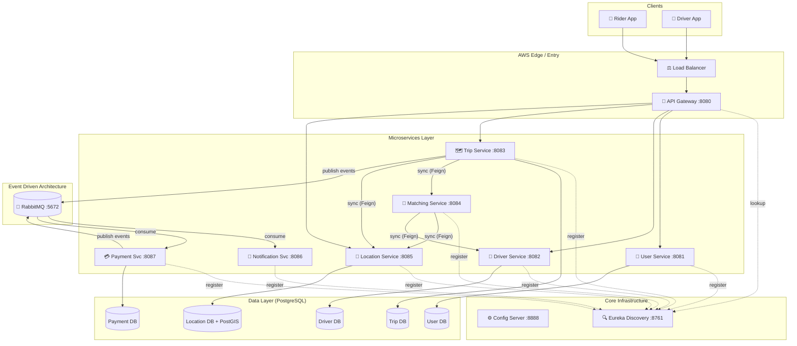
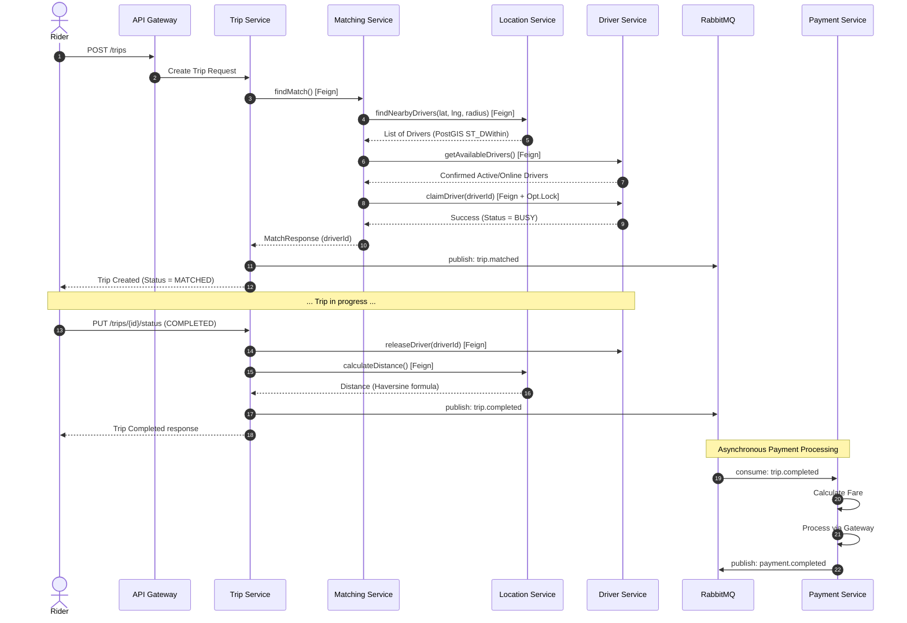
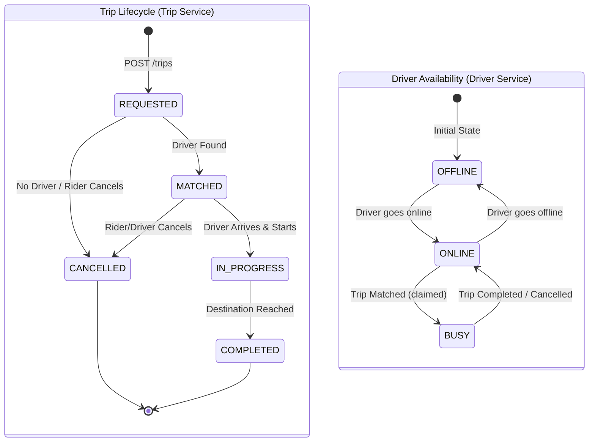
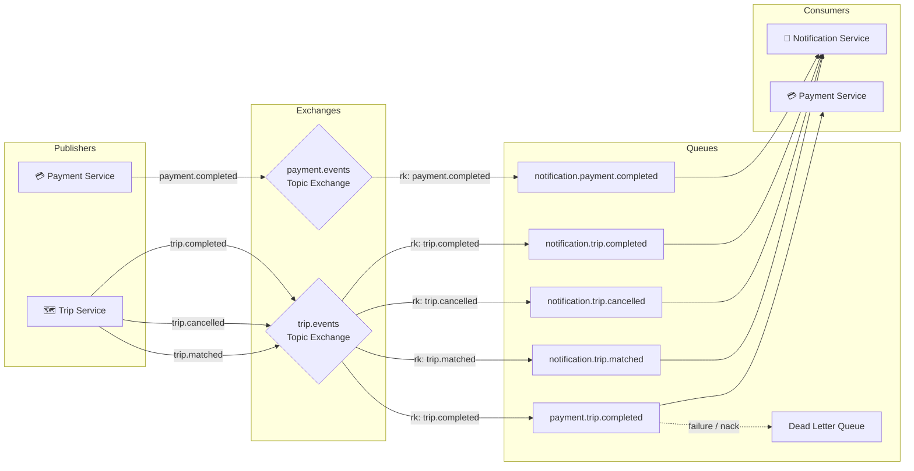

# Ride-Sharing Microservices Architecture Diagrams

These diagrams map out the core architecture, synchronous and asynchronous workflows, state machines, and event-driven data flows of the Ride-Sharing Backend. They are designed to be easily embedded in your `README.md` or used for LinkedIn posts.

## 1. System Architecture Map
This represents the production-ready topological view of the infrastructure and microservices layer.

---

## 2. Trip Workflow & Orchestration (Sequence Diagram)
This details the separation between the **synchronous** trip creation flow and the **asynchronous** payment and notification processing.

---

## 3. Core State Machines
Visualizing the lifecycle constraints enforced by the system for both Trips and Driver availability.

---

## 4. RabbitMQ Event-Driven Architecture
Shows how domain events are routed through Topic Exchanges to multiple distinct consumer queues.

