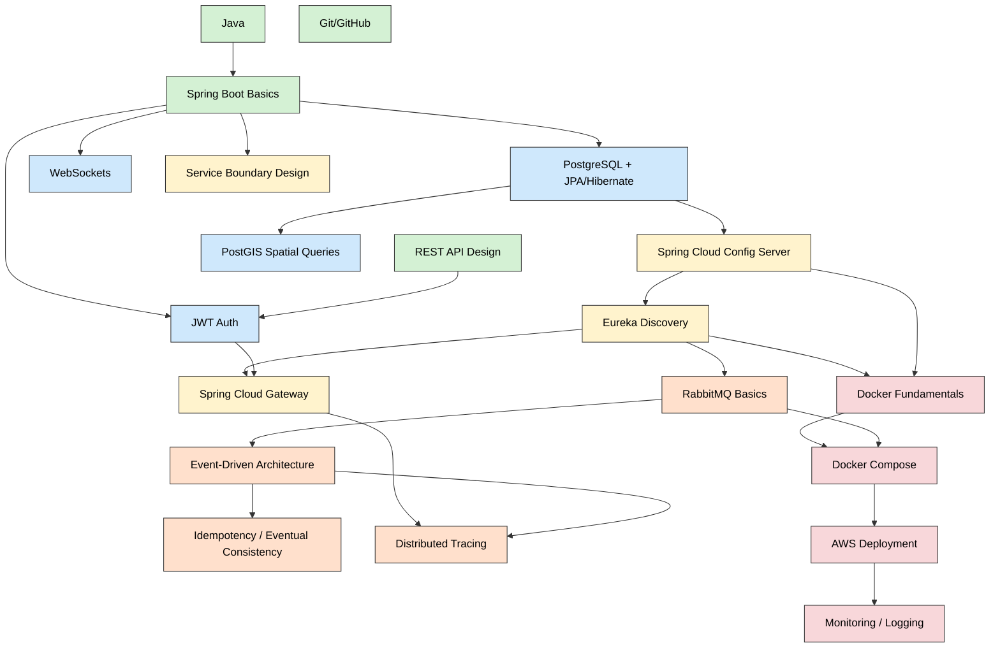

# Technology Dependency Graph & First-Service Starting Point

## Dependency Graph

This graph shows which technologies require understanding *other* technologies first. An arrow `A --> B` means "B depends on / builds on A" — i.e., learn A before B.

**Color key:** green = Level 1 (Fundamentals) · blue = Level 2 (Backend Foundations) · yellow = Level 3 (Microservices Foundations) · orange = Level 4 (Distributed Systems) · red = Level 5 (Production Engineering).

---

## How to Read This Graph

Notice the chains that matter most:

- **`Spring --> JPA --> Config --> Eureka --> Gateway`** is the main spine of the whole project. Everything else hangs off it.
- **`PostGIS`** only depends on JPA/PostgreSQL basics — it's a side-branch you can pick up independently once you're comfortable with PostgreSQL + JPA, in parallel with Config/Eureka work.
- **`Docker` and `Compose`** depend on Eureka + Config + RabbitMQ being understood conceptually — not because Docker itself is hard, but because *what you're containerizing* needs to make sense first. Don't learn Docker networking and Eureka registration simultaneously; you won't be able to tell which one is causing a given error.
- **`EDA / Idempotency / Tracing`** sit downstream of RabbitMQ basics — these are *patterns*, not tools, and they only make sense once you have a real async message flowing between two services.
- **`AWS`** is a terminal node — it depends on Docker Compose because production deployment should mirror a local multi-container setup you've already proven works.

---

## Minimum Knowledge Needed Before Building the First Service

Per the Development Strategy (Section 7 of the blueprint), the **first service to build is User Service** — as a plain Spring Boot app, no Eureka/Config/Docker yet.

**You need, at minimum:**

1. **Java + Spring Boot fundamentals** — you already have this.
2. **REST API design** — endpoints, request/response bodies, status codes — you already have this.
3. **PostgreSQL + JPA/Hibernate basics** — entity mapping, repositories, basic relationships (User has Role). This is the *only* genuinely new thing required to start.
4. **JWT auth basics** — enough to issue and validate a token on login (`POST /auth/login`, `POST /auth/register`).
5. **Git/GitHub workflow** — already have this, just set up the repo structure (likely a multi-module or multi-repo setup — decide this now, before writing code, since it affects how Config/Eureka get wired in later).

**Everything else can wait:**

- Eureka, Config Server, Gateway → not needed until Step 2–4 of the development strategy, *after* User/Driver/Trip exist and talk via hardcoded URLs.
- PostGIS → not needed until you build Location Service (Step 5).
- RabbitMQ/EDA → not needed until Step 7.
- Docker → not needed until Step 9.
- AWS/Monitoring → last.

**Practical takeaway:** the *only* gap between what you know now and what you need to start coding is **PostgreSQL + JPA + basic JWT** — roughly the lower half of Level 2 in the roadmap. Everything in Levels 3–5 can be learned just-in-time, anchored to the specific step in the development strategy where it first becomes necessary.
